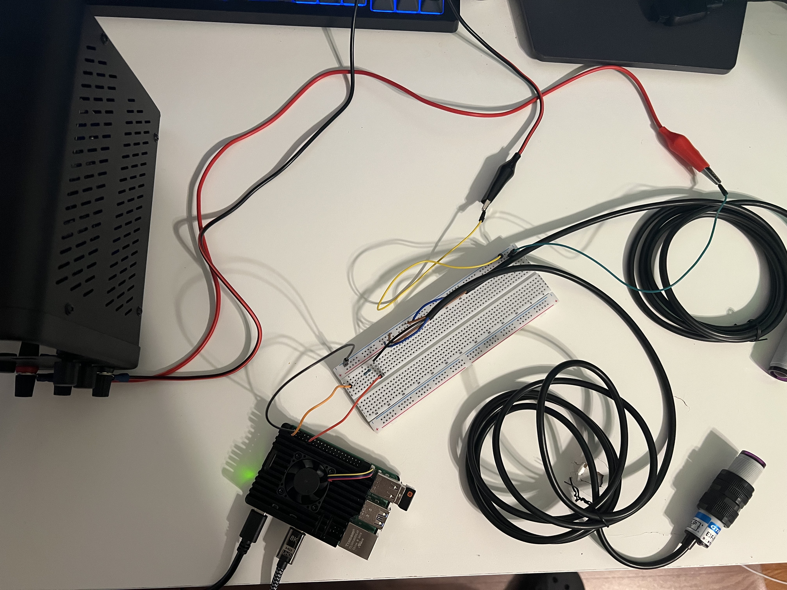

# **PhotonAlert**
## With the help of a Raspberry Pi 5, the detection of movement through a photoelectric infrared sensor is relayed through the cloud communication API, Twillio, to display a Whatsapp notification on a phone

## **Components**:
### Sensor:
- The sensor used is the E18-D50NK 5V, NPN NO 3-80cm variant

  - Link:
https://www.aliexpress.com/item/1005005755910427.html?spm=a2g0o.order_list.order_list_main.5.153c18029qaJU2 

### Power Supply:
- The power supply is the WANPTEK WSP3010H programmable DC power supply

  - Link: 
https://www.amazon.ca/Variable-Quick-Charge-Interface-0-30V-10A/dp/B0D8KF8QZ2?crid=96VJA3H87RN7&dib=eyJ2IjoiMSJ9.Rd2RdH3Nh_tRAtVsN0QRR26M0xWgx40gAmGywWu3InihOBATUIXQhnkFYmAbDKK96d0C-ZxMVbZNaXQ1p0pS9MGEqyDUN7LKJQwp3H5z0fGh3M1ZrFvHDdoctwa2OdwU_T71jfwYg9bozxGOGLE7SxOlrk8aFb_Ls-3etSvCxUHcuK5biWv3Sy8bh_yfGluldmyxg7K-8I0XT6y0gCuGf3mBTIGNpgeiJtXN5Jczq5HtT6kWE1TJF_8xzhIjhClcpz0n88pn8LExWZHmu1DfsuQ4MRaZ05Cyavk5QLX6sOb9FQzu4n13oRcSUfMEWucsH4EZTJ_nXh8vYmeC8gylM9gctRtfRu72mfBk6xPX0xYKaP_Tw9lRrCmSwsD4pf9NAFz18wz3Ep0Pm39Tcbon3rANz24EdBai8io0A8bzgSquorujfLhwbYo2bbm-9HpJ._D-RZyC06aM8NEu5kWulw9sFY2WDHgQg_hxhBMcumOg&dib_tag=se&keywords=wanptek+dc+power+supply&qid=1737260880&sprefix=wanptek+dc+power+suppl%2Caps%2C101&sr=8-5

- ### The circuit makes use of 5 jumper wires, three male-female for raspberry pi connection and two male-male to connect the power supply to the power and ground rails
- ###The resistor used is 3kΩ but anything between 1kΩ-10kΩ should function properly

*All other component specifications are irrelevant*

# Circuit

